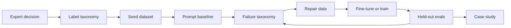

# Codex Skills


Reusable Codex skills for turning real workflows into useful AI-assisted software artifacts.

This repo collects practical skills built from real Codex work: workflow-first CopilotKit interfaces, repo-local plugin packaging, agent-facing competitive intelligence, and other repeatable engineering patterns that are useful beyond a single project.

## Skills

| Skill | Purpose | Status |
| --- | --- | --- |
| [`copilotkit-workflow-ui-builder`](skills/copilotkit-workflow-ui-builder/SKILL.md) | Add a CopilotKit UI around an existing workflow or backend. | Validated locally |
| [`repo-plugin-packaging`](skills/repo-plugin-packaging/SKILL.md) | Turn an existing project into a shareable repo-local Codex plugin. | Validated locally |
| [`cloudflare-remote-mcp-worker`](skills/cloudflare-remote-mcp-worker/SKILL.md) | Deploy an MCP-capable repo as a Cloudflare Worker with remote `/mcp` verification. | Validated locally |
| [`bumblebee-inventory`](skills/bumblebee-inventory/SKILL.md) | Run Bumblebee package/MCP inventory scans and generate raw, public, and agent-ready reports. | Validated locally |
| [`content-os-manager`](skills/content-os-manager/SKILL.md) | Set up a markdown Content OS with Codex thread prompts for ideas, drafts, feedback, published posts, and themes. | Validated locally |
| [`competitive-intelligence-agent`](skills/competitive-intelligence-agent/SKILL.md) | Operate sample-first and live CocoIndex-backed competitive intelligence through MCP tools. | Validated locally |
| [`wiki-maintainer`](skills/wiki-maintainer/SKILL.md) | Build and maintain a local interlinked LLM Wiki from raw sources, with linting, Q&A, outputs, and agent exports. | Validated locally |
| [`expert-judgment-distillation`](skills/expert-judgment-distillation/SKILL.md) | Build expert-judgment datasets, evals, repair loops, rubric models, and case-study writeups. | Validated locally |

## Why This Exists

Most agent UI examples start as chat-first demos. These skills are meant for the harder and more useful path: start with an existing workflow, then add an AI interface that understands the product state and helps move real work forward.

The working pattern is:

1. Inspect the existing app and backend.
2. Map workflow state into copilot context.
3. Register narrow frontend tools for app control.
4. Render structured UI for evidence, decisions, approvals, and outputs.
5. Keep human gates visible.
6. Validate with real build, smoke, and browser checks where possible.
7. Produce handoff notes that a builder or community reader can reuse.

## Featured Workflow: Competitive Intelligence Agent

The [`competitive-intelligence-agent`](skills/competitive-intelligence-agent/SKILL.md) skill captures an agent-first pattern for market monitoring:

```text
Sample articles -> local analyzer -> MCP tools -> brief/dashboard
Tavily -> CocoIndex -> Postgres -> MCP tools -> Claude/Codex/other agents
```

Use it when you want a dependable no-key demo first, then a live CocoIndex proof path with explicit competitor arguments such as `competitors="Apple,Microsoft"` or `competitors=["Perplexity", "Glean"]`. The skill keeps generated reports local, protects `.env` secrets, and gives agents the exact tool-call flow for creating briefs and dashboards.

## Featured Workflow: Expert Judgment Distillation

The [`expert-judgment-distillation`](skills/expert-judgment-distillation/SKILL.md) skill captures a repeatable pattern for turning domain taste into a model-ready workflow:



Use it for workflows where generic prompting is not enough: financial relevance, editorial triage, legal intake, content moderation, sales lead scoring, recruiting screens, or any repeated judgment task that needs held-out evidence and careful failure repair. The skill includes a cited Bridgewater/Tinker process-map reference while avoiding copyrighted article reuse or claims that it reproduces their exact training recipe.

## Install A Skill Locally

From this repo:

```bash
mkdir -p "${CODEX_HOME:-$HOME/.codex}/skills"
cp -R skills/copilotkit-workflow-ui-builder "${CODEX_HOME:-$HOME/.codex}/skills/"
cp -R skills/repo-plugin-packaging "${CODEX_HOME:-$HOME/.codex}/skills/"
cp -R skills/cloudflare-remote-mcp-worker "${CODEX_HOME:-$HOME/.codex}/skills/"
cp -R skills/bumblebee-inventory "${CODEX_HOME:-$HOME/.codex}/skills/"
cp -R skills/content-os-manager "${CODEX_HOME:-$HOME/.codex}/skills/"
cp -R skills/competitive-intelligence-agent "${CODEX_HOME:-$HOME/.codex}/skills/"
cp -R skills/wiki-maintainer "${CODEX_HOME:-$HOME/.codex}/skills/"
cp -R skills/expert-judgment-distillation "${CODEX_HOME:-$HOME/.codex}/skills/"
```

Then start a new Codex session and ask for the skill by name, or ask for a task that matches its description.

### Wiki Maintainer Setup

To use the LLM Wiki skill on your own machine:

```bash
git clone https://github.com/Laksh-star/codex-skills.git
cd codex-skills
mkdir -p "${CODEX_HOME:-$HOME/.codex}/skills"
cp -R skills/wiki-maintainer "${CODEX_HOME:-$HOME/.codex}/skills/"
```

Start a new Codex session and ask:

```text
Use wiki-maintainer to set up my LLM Wiki at ~/knowledge-wiki.
```

Codex will ask for your domains, whether to enable voice capture, and whether to initialize git. After setup, drop sources into `raw/` and ask Codex to compile, lint, query, generate outputs, or refresh `agent_exports/`.

Optional local tools:

- Python 3.10+ for the bundled helper scripts.
- git for version history.
- Obsidian or any markdown editor for reading the wiki.
- `pdftotext` from Poppler when you want to ingest PDFs.

## Validate A Skill

If you have the Codex skill creator tools available:

```bash
python3 ~/.codex/skills/.system/skill-creator/scripts/quick_validate.py \
  skills/copilotkit-workflow-ui-builder

python3 ~/.codex/skills/.system/skill-creator/scripts/quick_validate.py \
  skills/repo-plugin-packaging

python3 ~/.codex/skills/.system/skill-creator/scripts/quick_validate.py \
  skills/cloudflare-remote-mcp-worker

python3 ~/.codex/skills/.system/skill-creator/scripts/quick_validate.py \
  skills/bumblebee-inventory

python3 ~/.codex/skills/.system/skill-creator/scripts/quick_validate.py \
  skills/content-os-manager

python3 ~/.codex/skills/.system/skill-creator/scripts/quick_validate.py \
  skills/competitive-intelligence-agent

python3 ~/.codex/skills/.system/skill-creator/scripts/quick_validate.py \
  skills/wiki-maintainer

python3 ~/.codex/skills/.system/skill-creator/scripts/quick_validate.py \
  skills/expert-judgment-distillation
```

Each published skill is validated locally before being added here.

## Repository Standards

- Keep each skill self-contained under `skills/<skill-name>/`.
- Use lowercase hyphen-case skill names.
- Keep `SKILL.md` concise and action-oriented.
- Put deeper workflow details in `references/`.
- Avoid repo-specific secrets, private paths, and fragile local assumptions.
- Add a release checklist entry before publishing a skill publicly, using `docs/release-checklists/`.

See [publishing guidelines](docs/publishing-guidelines.md), the [release checklist template](templates/skill-release-checklist.md), the [`competitive-intelligence-agent` checklist](docs/release-checklists/competitive-intelligence-agent.md), and the [`expert-judgment-distillation` checklist](docs/release-checklists/expert-judgment-distillation.md).

Only validated, reusable skills are published under `skills/`.

## Suggested GitHub About Fields

GitHub description:

```text
Reusable Codex skills for building workflow-first AI and CopilotKit interfaces around real apps.
```

Topics:

```text
codex, codex-skills, copilotkit, agentic-ui, ai-agents, developer-tools, workflow-automation
```
