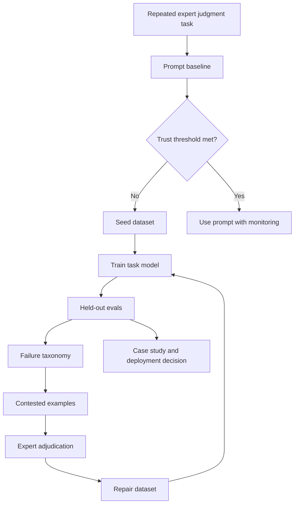
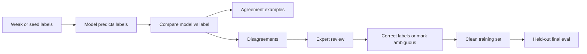

# Bridgewater/Tinker Process Map

Use this reference when the user asks to model a workflow after the Thinking Machines Lab and Bridgewater AIA Labs article, or asks how their experiment maps to it.

## Citation Basis

Reference basis: Sarah Su, Kevin Zhu, Emily Xiao, Rohan Alur, and Daniel Kang, "Learning to Replicate Expert Judgment in Financial Tasks," Thinking Machines Lab, June 2026.

Article URL: https://thinkingmachines.ai/news/learning-to-replicate-expert-judgment-in-financial-tasks/

Use this as a cited conceptual basis only. Do not copy article text, figures, images, tables, or proprietary examples into user artifacts. Do not imply endorsement by Thinking Machines, Bridgewater, or Tinker.

## Safe Framing

This workflow is inspired by the expert-judgment distillation pattern described in the article:

1. Identify a repeated expert judgment task.
2. Show that generic prompting helps but plateaus.
3. Construct higher-quality adjudicated data.
4. Route contested examples to expert review.
5. Train a task-specific model.
6. Evaluate on held-out workflow tasks.
7. Iterate on concrete failure modes.

Important caveat: this skill generalizes the dataset, evaluation, failure-analysis, and case-study loop. It does not claim to implement the article's exact training recipe, including interleaved batching, CISPO loss with asymmetric clipping, or on-policy distillation.

## Process Map

## Dataset Quality Loop

## Mapping Template

| Article Pattern | User Project Mapping |
| --- | --- |
| Investor information filtering | The user's repeated expert decision task |
| Investor taste and relevance judgment | Domain expert taste, priority, risk, or value judgment |
| Prompting improves but remains below trust threshold | Baseline prompts improve but fail hard evals or safety gates |
| Non-expert labels can be noisy | Synthetic, vendor, or weak labels need adjudication |
| Contested examples sent to experts | Edge-case queue, failure taxonomy, and human review |
| Fine-tuned task model | Domain-specific SFT, RL, distillation, or structured-output model |
| Held-out workflow tasks | Continuity evals, transfer holdouts, stress tests |
| Accuracy and F1 | Accuracy, macro F1, exact match, dangerous misses, action accuracy |
| Cheaper custom model | Smaller or narrower model used only if evals justify deployment |

## Case-Study Claim Boundaries

Strong claims require evidence:

- "We replicated the process pattern" requires a taxonomy, dataset, evals, repair loop, and held-out results.
- "We reproduced the training recipe" requires implementing comparable optimization details, not only using Tinker or fine-tuning.
- "The model learned expert judgment" requires performance on held-out, realistic, preferably expert-adjudicated examples.
- "The workflow is deployable" requires safety gates, regression checks, and operational handling for uncertain cases.

## Editorial Judgment Example Mapping

For an editorial triage case:

| Article Pattern | Editorial Case |
| --- | --- |
| Financial article relevance | Newsroom item triage |
| Investor interest | Editorial urgency, audience value, durability, and risk |
| Relevant and interesting vs irrelevant | Clip now, publish, review, ignore, or save evergreen |
| Contested financial examples | Sparse headlines, risky posts, ordinary official updates, evergreen explainers |
| Held-out financial tasks | Old real holdout, real-style holdout, finance stress, transfer stress |
| Mistake reduction | Macro F1 gains, fewer dangerous misses, better action/risk calibration |

Use this as an example, not as required structure for every domain.
