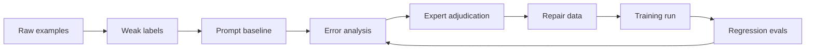
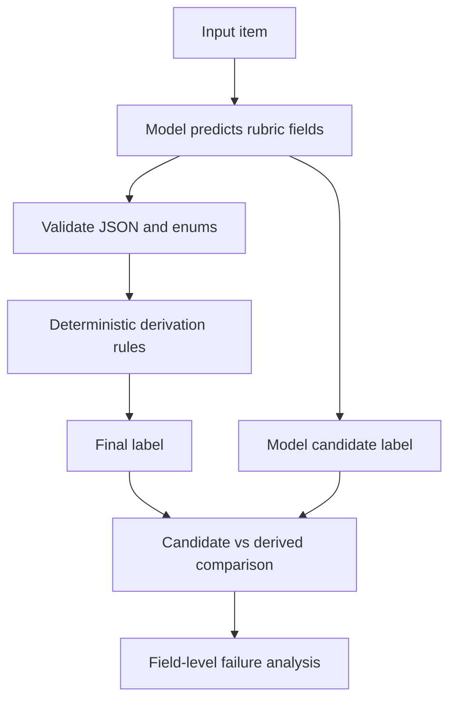

# Extension Playbook

Use this when the user asks what else to add to an expert-judgment workflow or how to make the skill more useful for ML-oriented teams.

## High-Value Additions

- **Baseline comparison table**: naive prompt, expert prompt, structured prompt, best fine-tune, rubric-first model.
- **Eval dashboard artifact**: one Markdown or HTML report that summarizes metrics, confusion matrices, dangerous misses, and promotion decisions.
- **Adjudication queue**: a CSV/JSONL file for examples where labels disagree, confidence is low, or safety impact is high.
- **Repair-set manifest**: a small file listing why each repair set exists, which failure bucket it targets, and which holdout it must not leak.
- **Run card**: one short card per experiment with objective, dataset versions, training method, evals, regressions, and decision.
- **Two-stage rubric rules**: deterministic mapping code plus a derived-vs-candidate disagreement report.
- **Case-study appendix**: a public-safe note that maps the workflow to the Bridgewater/Tinker process without copying article text.

## Visuals To Generate

Add Mermaid diagrams to public docs when useful:

For rubric-first models:

## Maturity Checklist

- The taxonomy has examples and counterexamples for every label.
- Every train/test split has stable IDs and provenance.
- There is at least one untouched continuity holdout.
- Evaluation reports include per-label metrics, not only aggregate accuracy.
- Dangerous misses are reviewed separately from ordinary mistakes.
- Repair data is tied to named failure buckets.
- Exact holdout leakage is checked before training.
- The promotion decision is written down for each run.

## What Not To Add

- Do not include proprietary source rows in a public skill.
- Do not embed large article excerpts or copyrighted tables.
- Do not make the skill depend on one vendor's fine-tuning API.
- Do not optimize for attractive metrics by dropping hard transfer evals.
